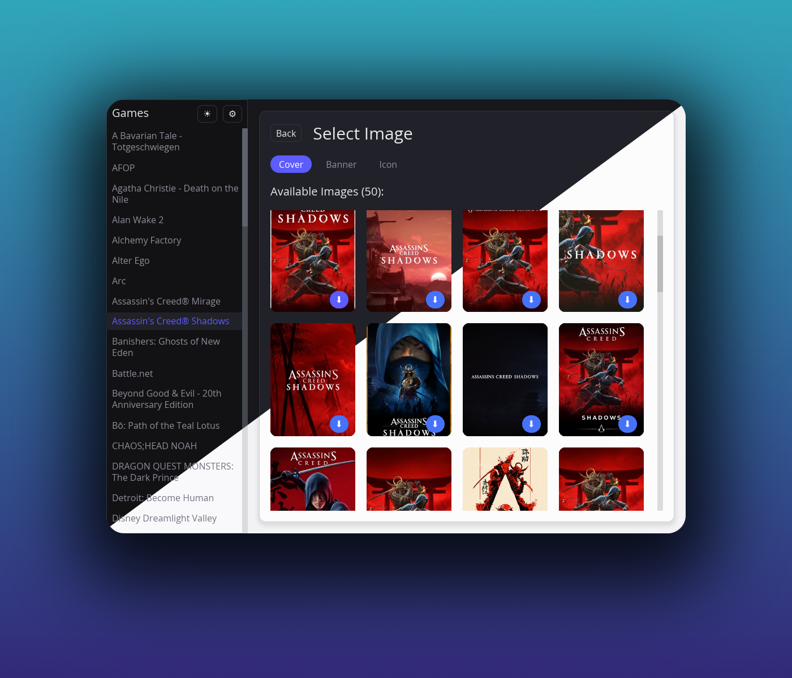

# Afterglow

Afterglow is a Rust-based GUI application designed to update game images (covers, icons, banners) for [Lutris](https://lutris.net/). The application allows users to update these images from online sources, currently [SteamGridDB](https://www.steamgriddb.com/).



## Features

- Update game covers, banners and icons for Games missing from Lutris database
- Supports native and Flatpak Lutris installations out of the box, as well as custom setups
- Handles [`sgdb://`](https://www.steamgriddb.com/boop) “SGDBoop” links so you can apply shared artwork from the browser straight into Lutris

## Getting Started

- Download the AppImage from the Releases section 
- Ensure it is executable: `chmod +x Afterglow.AppImage`
- Run the AppImage

## Usage

Upon launching the application, you will be presented with a dashboard where you can view and manage your games and their associated images. You can navigate to the settings to configure image sources and preferences. For Updating Images you need a [SteamGridDB](https://www.steamgriddb.com/) API key.

### SteamGridDB API Key
1. Sign in to [SteamGridDB](https://steamgriddb.com) with your Steam account
2. Go to [Preferences > API](https://www.steamgriddb.com/profile/preferences/api)
3. Copy your API key

### SGDBoop Protocol Handler

Afterglow registers itself as an `sgdb://` handler via the included desktop file. Once the app has been installed, clicking one of the “BOOP” links on SteamGridDB will show a dedicated popup to select a lutris game. This requires integrating the AppImage via [AppImageLauncher](https://github.com/TheAssassin/AppImageLauncher) or [Gear Lever](https://github.com/mijorus/gearlever)


## Development

### Prerequisites

- Rust (1.92 or later)
- Cargo (comes with Rust)

### Installation

1. Clone the repository:

   ```
   git clone https://github.com/BigBoot/afterglow.git
   ```

2. Navigate to the project directory:

   ```
   cd afterglow
   ```

3. Build the project:

   ```
   cargo build
   ```

4. Run the application:

   ```
   cargo run
   ```

## Contributing

Contributions are welcome! Please fork the repository and submit a pull request for any enhancements or bug fixes.

## License

This project is licensed under the MIT License - see the [LICENSE](LICENSE) file for details.

## Credits
- [@Noodles](https://github.com/callmenoodles) for the inspiration with [lutris-coverup](https://github.com/callmenoodles/lutris-coverup)
- [SteamGridDB](https://www.steamgriddb.com/) for the assets
